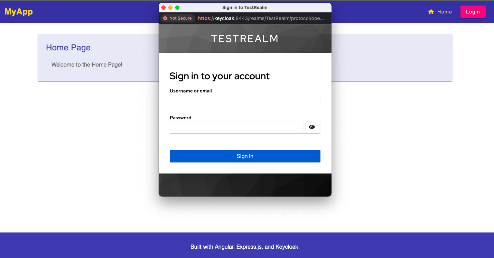

# Angular BFF with Keycloak Authentication

Secure authentication implementation using Angular, Express.js BFF pattern, and Keycloak with complete client-side token isolation.



## Key Features

- 🔐 Complete client-side token isolation (BFF pattern)
- 🌐 SSL/TLS encryption with custom CA
- 📦 Session management (in-memory or Redis)
- 🔄 Hot-reload development setup
- 🐳 Full Docker support

## Architecture

| Component | Technology | Port | Purpose |
|-----------|------------|------|---------|
| Frontend | Angular 19 | 4200 | Single Page Application |
| Backend | Express.js | 3000 | Backend-For-Frontend (BFF) |
| Keycloak | v26 | 8443 | Identity Provider |
| Redis | v7 | 6379 | Session Store (optional) |

## Quick Start

```bash
# Clone and enter project
git clone https://github.com/brakmic/Angular-BFF-Keycloak
cd Angular-BFF-Keycloak

# Setup SSL certificates
./scripts/setup_ssl.sh

# Start all services
docker compose up -d
```

Access the applications:
- Frontend: https://frontend.local.com:4200
- Backend: https://backend.local.com:3000
- Keycloak: https://keycloak.local.com:8443

## Prerequisites

- Docker 20.10+
- Node.js 18.x
- OpenSSL
- Local domain setup (see [Domain Setup](docs/DOMAINS.md))

## Documentation

- [Domain & SSL Setup](docs/DOMAINS.md)
- [Session Management](docs/SESSIONS.md)
- [Docker Configuration](docs/DOCKER.md)
- [Development Guide](docs/DEVELOPMENT.md)
- [Troubleshooting](docs/TROUBLESHOOTING.md)

## License

[MIT](./LICENSE)
