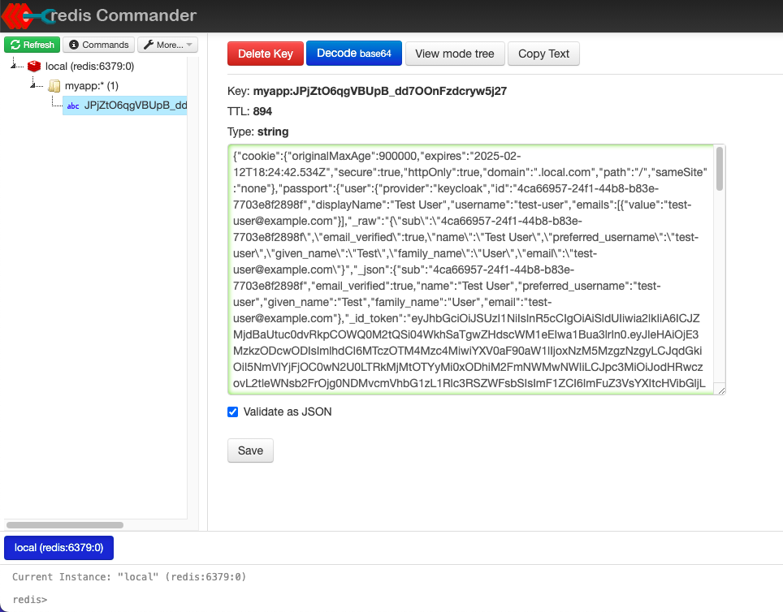

# Session Management Guide

## Overview

The BFF (Backend-For-Frontend) supports two session storage options:
- In-memory session store (default)
- Redis session store (optional, persistent)

## Session Store Options

### 1. In-Memory Session Store

**Advantages:**
- Simple setup, no additional infrastructure
- Quick to get started
- Suitable for development

**Limitations:**
- Sessions lost on server restart
- Not suitable for production
- Limited by available memory

### 2. Redis Session Store

**Advantages:**
- Persistent across server restarts
- Scalable session management
- Real-time monitoring
- Configurable TTL (Time To Live)

**Configuration:**
```ini
# In backend/.env
SESSION_STORE=redis
REDIS_HOST=redis_server
REDIS_PORT=6379
REDIS_PASSWORD=changeit
```

## Redis Commander UI



### Access
- URL: http://localhost:8081
- Default credentials:
  ```ini
  Username: admin
  Password: admin
  ```

### Features
- View active sessions
- Monitor session expiration
- Debug authentication state
- Inspect session data

### Security Configuration
```yaml
# In redis/docker-compose.yaml
environment:
  - HTTP_USER=admin
  - HTTP_PASSWORD=admin
  - HTTP_AUTH_ENABLED=1
```

## Session Management Features

### Cookie Configuration
```typescript
cookie: {
  secure: true,
  httpOnly: true,
  domain: '.local.com',
  maxAge: 900000  // 15 minutes
}
```

### Session Operations

**List Active Sessions:**
```typescript
listActiveSessions(): Promise<string[]>
```

**Invalidate Session:**
```typescript
invalidateSession(sessionId: string): Promise<void>
```

**Refresh Session TTL:**
```typescript
refreshSession(sessionId: string, newTTL: number): Promise<void>
```

## Development Tools

### Redis CLI Commands
```bash
# Connect to Redis
redis-cli -h redis_server -a changeit

# List all sessions
KEYS myapp:*

# Get session details
GET myapp:session_id

# Monitor real-time operations
MONITOR
```

### Debug Logging
```typescript
// Session operations are logged at debug level
logger.debug('Redis GET operation:', { sid });
logger.debug('Redis SET operation:', { sid, ttl });
```

## Troubleshooting

### Common Issues

1. **Connection Refused**
   ```bash
   # Check Redis status
   docker compose ps redis_server
   
   # Test connectivity
   nc -vz redis_server 6379
   ```

2. **Session Not Found**
   - Verify TTL hasn't expired
   - Check session prefix (default: 'myapp:')
   - Confirm Redis connection settings

3. **Authentication Failed**
   - Verify Redis password in .env
   - Check Redis Commander credentials
   - Confirm network connectivity

### Monitoring Tools

1. **Redis Commander**
   - Real-time session monitoring
   - TTL tracking
   - Data inspection

2. **Docker Logs**
   ```bash
   # View Redis logs
   docker compose logs -f redis_server
   
   # View Redis Commander logs
   docker compose logs -f redis_commander
   ```

## Security Notes

- Redis Commander is for development only
- Disable or secure in production
- Use strong passwords
- Restrict network access
- Enable Redis persistence carefully
